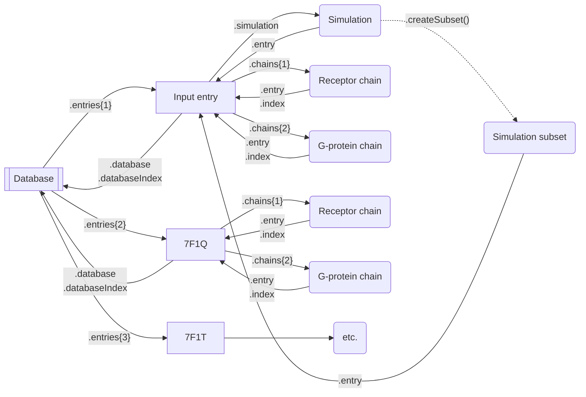

# API reference


## Architecture




## Database

The first step after creating a database is to register _entries_ using the _database_.fetch() (using the RCSB database) or _database_.read() (using local files). An entry represents a single PDB file. All entries are stored in the _database_.entries property.

A typical initialization goes like this:

```matlab
database = Database("some/directory")

database.fetch(...)
database.fetch(...)
database.read(...)

% Align sequences
database.align()

% Align structures
database.alignStructures()

% Add labels
database.label(...)
```


### Database(_dir_)

Create a database object at _dir_, which may or may not already exist.


### _database_.fetch(_pdbCode_, _chainNames_)

Add an entry to the database by fetching the PDB file coded _pdbCode_ from www.rcsb.org. The entry's name will be _pdbCode_. See _database_.read() for details on the _chainNames_ argument.

```matlab
database.fetch("6VMS", 'ACB')
```

### _database_.read(_path_, _chainNames_, _name_)

Add an entry to the database using the PDB file at _path_. A set of known chain names can be specified with the _chainNames_ argument which accepts a 1xn char array of chain names (e.g. `'ABC'` or `['A', 'C', 'B']`), as specified in the PDB file.

```matlab
database.read("somewhere/prot.pdb", 'ACB', "My protein")
```

The chains defined across entries have to match, i.e. chain 1 in entry 1 has to correspond to chain 1 in entry 2, if defined. If a chain is missing from one of the entries, it can be skipped by using whitespace instead of a normal character, such as `'A B'`.


### _database_.align()

Populate the _database_.residues table by aligning the sequence of all defined chains.

No more entries should be added after calling align().


### _database_.entries

Cell array of size 1xn containing _Entry_ objects in the order they were registered.

```matlab
database.fetch("6VMS", '...')
database.fetch("6CM4", '...')

database.entries{2} % Represents 6CM4
```


### _database_.residues

Cell array of size 1xn, where n is the maximum number of chains defined on an entry, which contains tables of size rx(m+2), where r is the number of residues and m the number of entries.

Each row of a table represents a single residue. The first m columns contain residue ids for a given residue and entry, and otherwise 0 if the residue is missing from that entry. The penultimate column, named `Label`, contains a label for that residue or an empty string. This column can be populated later on by _database_.label() or manually. The last column, named `Name`, contains an 1xm char array where the i-th character corresponds to the residue name (i.e. A for alanine) of the i-th entry, or whitespace if that residue is missing from that entry.

```
>> database.residues
col1 col2 Label Name
---- ---- ----- ----
32   0    ""    'P '
33   0    ""    'H '
34   41   ""    'YY' % The alignment starts here
35   42   ""    'YN' % There is a mismatch here

% This corresponds to following alignment:

PHYY
  |:
--YN
```

Accessing residue data for a given chain, entry and residue can be done with the following operations:

```matlab
resId = database.residues{chainIndex}{residueIndex, entryIndex}
resName = database.residues{chainIndex}.Name(residueIndex, entryIndex)
resLabel = database.residues{chainIndex}.Label(residueIndex)
```

_database_.align() must be called prior to accessing this property.


### _database_.dir

The path to the database's directory.


### _database_.label(_entryIndex_, _mapPath_)

Adds labels to _database_.residues{1} using a map obtained from [GPCRdb](https://gpcrdb.org/residue/residuetable) and the _entryIndex_-th entry as reference.

```matlab
database.label(2, "somewhere/residue_table.xlsx")
```


### _database_.findResidue(_label_, 'ChainIndex', _chainIndex_)

Returns an nx1 array where each value corresponds to the id of the residue in chain _chainIndex_ (which defaults to 1) with label _label_, for each entry, or 0 otherwise.

```matlab
resIds = database.findResidue("3.50", 'ChainIndex', 2)
```


### _database_.findFeature(_label_, _before_, _after_, 'ChainIndex', _chainIndex_)

Returns an nxm array which is a generalized version of _database_.findResidue() that returns a set of residues instead of a single one, selecting _before_ additional residues before the target residue and _after_ residues after the target. m is therefore equal to `before + after + 1`.

```matlab
resIds = database.findFeature("3.50", 1, 3)
```


### _database_.alignStructures()

Aligns structures of every entry using their first chain and with respect to the first entry. See _entry_.alignStructures() for details.


### _database_.savePdbFiles(_path_)

Saves all entries of the database in the directory at _path_, which may or may not exist.


### _database_.calcRmsd(_feature_, _refEntry_)

Calculates the RMSD of residues of the first chain specified by _feature_ and with respect to the _refEntry_ entry. The return value is a 1xn cell array of mxk arrays where n is the number of entries, m the number of residues and k the number of frames. See calcrmsd() for details.

```matlab
database.calcRmsd(database.findFeature("3.50", 1, 3), 2)
```


### _database_.calcDistance(_feature1_, _feature2_)

Calculates the distance between two features. The return value is analoguous to that of _database_.calcDistance(). See calcrmsd() for details.


## Entry


### _entry_.atomCount

The number of atoms in this entry.


### _entry_.alignStructures(_refEntry_, _refResidues_, _objResidues_)

Aligns the structure of _entry_ with respect to that of _refEntry_, using residue ids provided in _refResidues_ and _objResidues_.


### _entry_.addSimulation(_path_)

Adds a simulation to this entry using the trajectories at _path_. Multiple runs can be added if multiple directories are specified using a wildcard, as recognized by [dir()](https://mathworks.com/help/matlab/ref/dir.html).

```matlab
entry.addSimulation("data/run*")
```


### _entry_.computeContacts(_chainA_, _chainB_, 'ContactCut', _contactCut_, 'ResIds', _resIds_, 'RCut', _rCut_)

Computes and returns the contacts between _chainA_ and _chainB_ using parameters _contactCut_ and _rCut_. For _chainB_, only residues specified by _resIds_ (which defaults to all residues) are considered. See _proteinContacts()_ for details.


### _entry_.hasChain(_chainIndex_)

Returns true if this entry has a non-null chain _chainIndex_.


### _entry_.getAtoms([selection])

Returns the atom indices that match [selection], a set of name-value arguments.

The following selectors can be used:

- 'Backbone', _backbone_: Selects backbone atoms if true.
- 'Chain', _chain_: Selects atoms from the chain with index _chain_.
- 'Name', _name_: Selects atoms with name _name_.
- 'NoName', _noname_: Selects atoms with a name other than _noname_.
- 'Residues', _residues_: Selects atoms from residues with ids _residues_.

When using multiple selectors, all conditions must be matched for an atom to be selected. All atom indices are returned if no selection is present.

```matlab
% Select backbone atoms from chain 2
entry.getAtoms('Backbone', true, 'Chain', 2)

% Select carbon atoms in residues 345 and 346
entry.getAtoms('Name', 'C', 'Residues', [345, 346])
```


## Simulation

### _simulation_.entry

A reference to the simulation's entry.


### _simulation_.traj

A nx1 cell array of mxk arrays which represents the trajectory of each run, where n is the number of runs, m the number of frames and k the number of coordinates, i.e. 3 times the number of atoms.


### _simulation_.trajLength

The length (number of frames) of the shortest run.


### _simulation_.dihedrals

See calcalldihedralsfromtrajs() for details.

_simulation_.computeDihedrals() must be called prior to accessing this property.


### _simulation_.dihedralsMat

An mxn array which represents the trajectory of every dihedral, where m is the number of frames and n the number of dihedrals.

_simulation_.computeDihedrals() must be called prior to accessing this property.


### _simulation_.reSort

See calcalldihedralsfromtrajs() for details.

_simulation_.computeDihedrals() must be called prior to accessing this property.


### _simulation_.mi

An nxn array which represents the mutual information of all dihedrals, where n is the number of dihedrals. The array is a symmetric matrix and its diagonal is zero.

_simulation_.computeMI() must be called prior to accessing this property.


### _simulation_.runCount

The number of runs in the simulation.


### _simulation_.align()

Aligns trajectories of the simulation. See superimpose() for details.


### _simulation_.concatRuns('Atoms', _atoms_, 'StartFrame', _startFrame_)

Concatenates all runs and returns a single array. Atoms and frames can be filtered using arguments _atoms_ and _startFrame_, respectively.

```matlab
% Concatenate runs but only keep carbon atoms
entry.simulation.concatRuns('Atoms', entry.getAtoms('Name', 'C'))
```


### _simulation_.computeDihedrals(_chain_, [options])

Computes dihedrals of _chain_ and populates _simulation_.dihedrals, _simulation_.dihedralsMat and _simulation_.reSort. See _calcalldihedralsfromtrajs()_ for details.

Options:
- 'HigherOrder', _higherOrder_: Used by _calcalldihedralsfromtrajs()_.
- 'Path', _path_: Path to save and restore dihedrals data.
- 'ReSort', _reSortPath_: Path to save and restore resort data.
- 'ResIds', _resIds_: Limits dihedral selection to _resIds_ (defaults to all residues).
- 'StartFrame', _startFrame_: Ignores all frames before _startFrame_.


### _simulation_.computeMI('Path', _path_)

Computes the mutual information and populates _simulation_.mi. This data can be saved and restored using _path_.


### _simulation_.computeContacts(_chainA_, _chainB_, 'ContactCut', _contactCut_, 'RCut', _rCut_, 'StartFrame', _startFrame_)

Computes and returns the contacts between _chainA_ and _chainB_ using parameters _contactCut_ and _rCut_. All frames before _startFrame_ are ignored. See _proteinContacts()_ for details.


### _simulation_.computeRmsd(_atomIndices_)

Computes and returns the RMSD of atoms with indices _atomIndices_.

```matlab
simulation.computeRmsd(entry.getAtoms('Chain', 2))
```


### _simulation_.computeRmsf(_atomIndices_, 'Exact', _exact_, 'StartFrame', _startFrame_)

Computes and returns the RMSF of atoms with indices _atomIndices_, ignoring all frames before _startFrame_ when returning (if _exact_ is true) or both when computing and returning (if _exact_ is false or missing).


### _simulation_.createSubset(_selection_, 'DihedralMatIndices', _dihedralMatIndices_)

Returns a new Simulation object which only contains one run and frames specified by _selection_. The _selection_ argument is a nx2 array which contains run indices in the first column and frame indices in the second column. The subset's length will thus be n.

```matlab
simulation.createSubset([ ...
  1 4; 1 5; 1 6; ... % Take three frames from run 1
  2 10; 2 11 ...     % And two from run 2
])
```

The _dihedralMatIndices_ argument can be provided for the subset's dihedralsMat property to be populated.


## Chain


### _chain_.entry

A reference to the chain's entry.


### _chain_.index

The chain's index in _chain_.entry.chains.


### _chain_.name

A 1x1 char array which contains the chain name as provided by the PDB.


### _chain_.atomIndices

An array of all indices of the chain.


### _chain_.resIds

An array of all residues ids of the chain.


### _chain_.helices

An nx2 array where each row corresponds to an alpha-helix, the first column being the starting residue id of this helix and the second column its last index.


### _chain_.secStruct

A 1xn char array as long as the chain's sequence, where every character corresponds to a residue's secondary structure (e.g. `H` for alpha-helix).


### _chain_.export()

Returns pdb and crd objects that can be used to save the chain in a PDB file, similar to those returned by readpdb().

```matlab
[pdb, crd] = chain.export()
```


### _chain_.seq

A 1xn char array that contains the sequence for this chain.


### _chain_.isSmall

True if the chain is a small molecule.


### _chain_.computeSecStruct()

Computes the second structure of the chain and populates _chain_.helices and _chain_.secStruct.


### _chain_.getAtoms()

Returns the atom indices of CAs in that chain.


### _chain_.getLigandAtoms()

If the chain is small molecule, returns the atom indices of non-hydrogen atoms. Otherwise, returns the atom indices of CAs.


### _chain_.formatName()

Returns a string representation of the chain.


### _chain_.formatAtoms(_atomIndices_)

Returns a string representation of the atoms with indicese _atomIndices_.


### _chain_.formatResidues(_resIds_, 'PrimaryEntry', _primaryEntry_, 'SecondaryEntry', _secondaryEntry_)

Returns a string representation of the residues with ids _resIds_. Two residue ids will be displayed: one with respect to _primaryEntry_ (which defaults to the chain's entry) and one with respect to _secondaryEntry_ (which defaults to the database's second entry).
